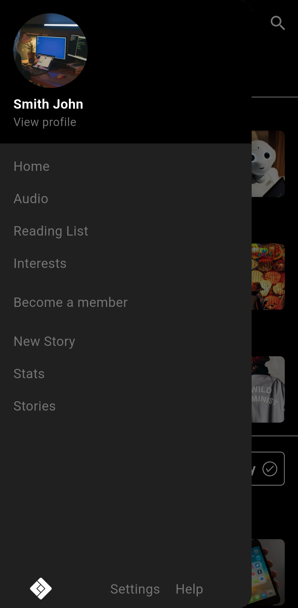

# Medium Flutter – UI Demo

A sleek Flutter UI demo inspired by Medium's reading experience and design style.  
This is a **UI-only** project designed to showcase layout and aesthetics, with no backend or live data.

---

## 📱 Overview

This demo includes various UI elements you'd expect in a Medium-like content or blog reading app, such as:

- Home feed with featured articles
- Author and category browsing
- Article detail pages
- Profile and reading stats preview

---

## 🔍 Status

**Demo only** – No backend integration or working functionality.

---

## 📸 Screenshots

<table>
  <tr>
    <td></td>
    <td></td>
    <td></td>
    <td></td>
  </tr>
  <tr>
    <td></td>
    <td></td>
    <td></td>
    <td></td>
  </tr>
  <tr>
    <td></td>
    <td></td>
    <td></td>
    <td></td>
  </tr>
  <tr>
    <td></td>
    <td></td>
    <td></td>
    <td></td>
  </tr>
  <tr>
    <td></td>
    <td></td>
    <td></td>
    <td></td>
  </tr>
</table>

---

## 📝 Notes

- Built entirely with Flutter
- Clean, modern, and modular UI components
- Ideal as a starting point for blog readers or article-based app prototypes

---

## ✍️ Created by

**Mohamed Ebrahim**
